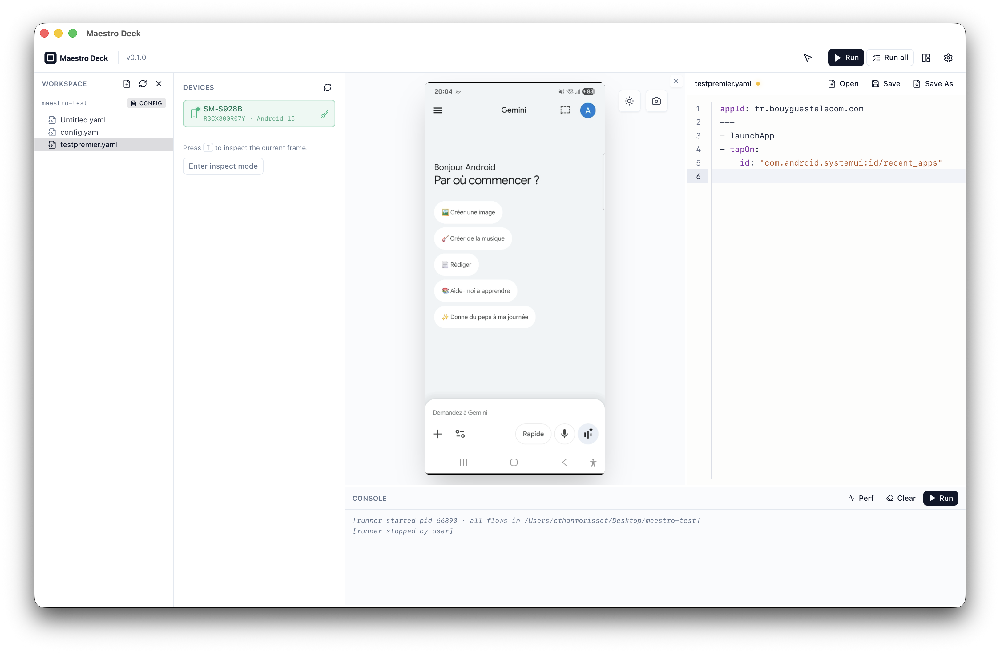

<h1 align="center">Maestro Deck — open-source visual IDE for Maestro mobile tests</h1>

<p align="center">
  <picture>
    <source media="(prefers-color-scheme: dark)" srcset="public/logo-horizontal-white.svg">
    <source media="(prefers-color-scheme: light)" srcset="public/logo-horizontal.svg">
    
  </picture>
</p>

<p align="center">
  Inspect your Android device, build <a href="https://maestro.mobile.dev">Maestro</a> flows visually, and run them — all locally, from one desktop window.
</p>

<p align="center">
  <a href="https://maestrodeck.cloud">Website</a> ·
  <a href="https://maestrodeck.cloud/docs">Docs</a> ·
  <a href="https://github.com/blueshork/maestro-deck/releases">Download</a> ·
  <a href="https://github.com/blueshork/maestro-deck/discussions">Discussions</a>
</p>

<p align="center">
  <a href="LICENSE"></a>
  <a href="package.json"></a>
  <a href="CONTRIBUTING.md"></a>
</p>

<p align="center">
  <a href="https://sonarcloud.io/summary/new_code?id=BlueShork_maestro-deck"></a>
  <a href="https://sonarcloud.io/summary/new_code?id=BlueShork_maestro-deck"></a>
</p>

<!-- TODO: replace with a real demo GIF before going public (single screencast: connect device → inspect element → write flow → run). -->
<p align="center">
  
</p>

---

## What is it?

Maestro Deck mirrors your Android phone on your desktop, lets you tap and type on it, inspects the UI, and helps you build & run [Maestro](https://maestro.mobile.dev) flows — all from one window.

- **Local only.** No account, no telemetry.
- **Fast.** Native Tauri shell, sub-second startup.
- **Open source.** Apache 2.0.

> Early development. v0.1 targets a single Android device over USB.

---

## Why Maestro Deck

Maestro is the YAML mobile-testing framework. Maestro Deck is the desktop app that makes writing those flows feel like clicking through your app instead of guessing selectors.

|  | Maestro Deck | Maestro Studio | Appium Inspector |
|---|---|---|---|
| Install | Single signed app (DMG/AppImage/MSI) | `maestro studio` (browser) | Java + Appium server setup |
| Footprint | Native Tauri shell (~80 MB RAM idle, system webview) | Electron-based, ~400+ MB RAM | JVM + Chromium inspector |
| Cost | Free, open source (Apache 2.0) | Free, closed source | Free, open source |
| Live mirroring | ✅ scrcpy-grade, 60 fps | ⚠️ Periodic screenshots | ⚠️ Screenshot-based |
| Smart selectors | ✅ id → text → desc → point | ✅ | ⚠️ Manual |
| Built-in YAML editor | ✅ CodeMirror + Maestro syntax | ✅ Basic | ❌ |
| One-click run with logs | ✅ | ❌ (separate CLI) | ❌ |
| Telemetry / account | None | mobile.dev account flows | None |
| Cloud execution | Out of scope (stays local) | Paid mobile.dev cloud | N/A |

If you already use Maestro Studio: Deck is a native, local-first alternative with a tighter mirror-inspect-edit-run loop and no cloud coupling.

---

## Features

- Live device mirroring over USB (60 fps target, low input latency)
- Tap, swipe, type, and key forwarding
- UI hierarchy inspection with element overlay
- Smart selectors (`resource-id` → `text` → `content-desc` → point fallback)
- YAML editor with Maestro syntax highlighting (CodeMirror)
- One-click flow run with live, color-coded logs
- macOS, Linux, Windows

---

## Quickstart

**1. Install ADB**

| OS | Command |
|----|---------|
| macOS | `brew install android-platform-tools` |
| Linux | `sudo apt install adb` |
| Windows | [Platform Tools](https://developer.android.com/tools/releases/platform-tools) + add to `PATH` |

**2. Install Maestro** — see the [official guide](https://maestro.mobile.dev/getting-started/installing-maestro).

**3. Get Maestro Deck** — download from [Releases](https://github.com/blueshork/maestro-deck/releases) or [build from source](#build-from-source).

**4. Plug in a device** with USB debugging enabled, accept the prompt, and pick it in the app.

---

## Build from source

Requires Node 20+, [pnpm](https://pnpm.io) 10+, Rust (via [rustup](https://rustup.rs)), and the [Tauri 2 prerequisites](https://v2.tauri.app/start/prerequisites/).

```bash
git clone https://github.com/blueshork/maestro-deck.git
cd maestro-deck
pnpm install
pnpm tauri:dev
```

Build a release bundle:

```bash
pnpm tauri:build
```

Installers are written to `src-tauri/target/release/bundle/`.

---

## How it works

Single-window Tauri 2 app: React + TypeScript on the frontend, Rust on the backend driving ADB and a bundled scrcpy server.

```
  React (webview)  <-- IPC -->  Rust (Tauri)  <-- USB -->  Android
```

More details in [docs/ARCHITECTURE.md](docs/ARCHITECTURE.md).

---

## Roadmap

| Version | Scope |
|---------|-------|
| **v0.1** *(current)* | Android USB, single device, inspector + editor + runner |
| **v0.2** | iOS simulator, multi-device, record mode |
| **v0.3** | iOS physical devices, plugin system |
| **v1.0** | Production-ready |

Cloud execution is a non-goal. Maestro Deck stays local.

---

## Contributing

Contributions of any size are welcome.

- [Good first issues](https://github.com/blueshork/maestro-deck/labels/good%20first%20issue)
- [Discussions](https://github.com/blueshork/maestro-deck/discussions)
- [CONTRIBUTING.md](CONTRIBUTING.md) for setup and PR process
- [Code of Conduct](CODE_OF_CONDUCT.md)

For security issues, see [SECURITY.md](SECURITY.md).

---

## License

[Apache 2.0](LICENSE) — Copyright 2026 Ethan Morisset and contributors.
