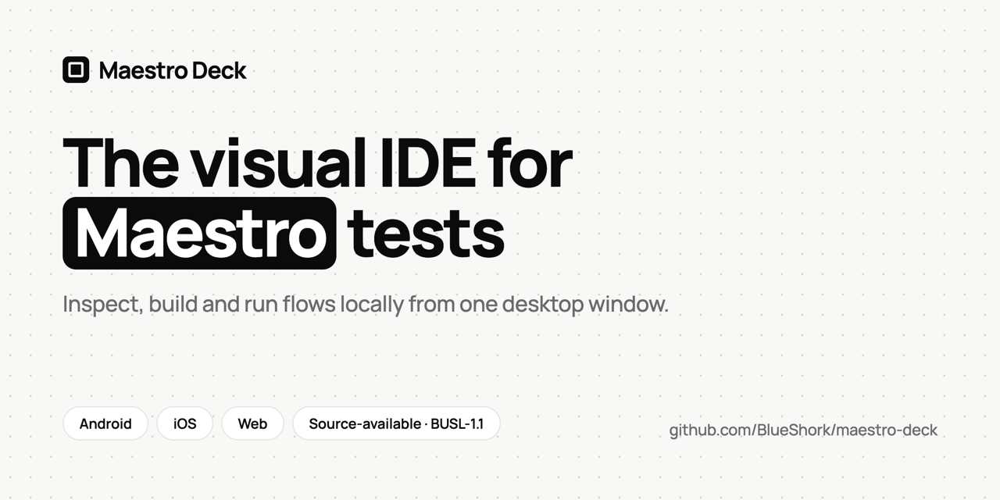
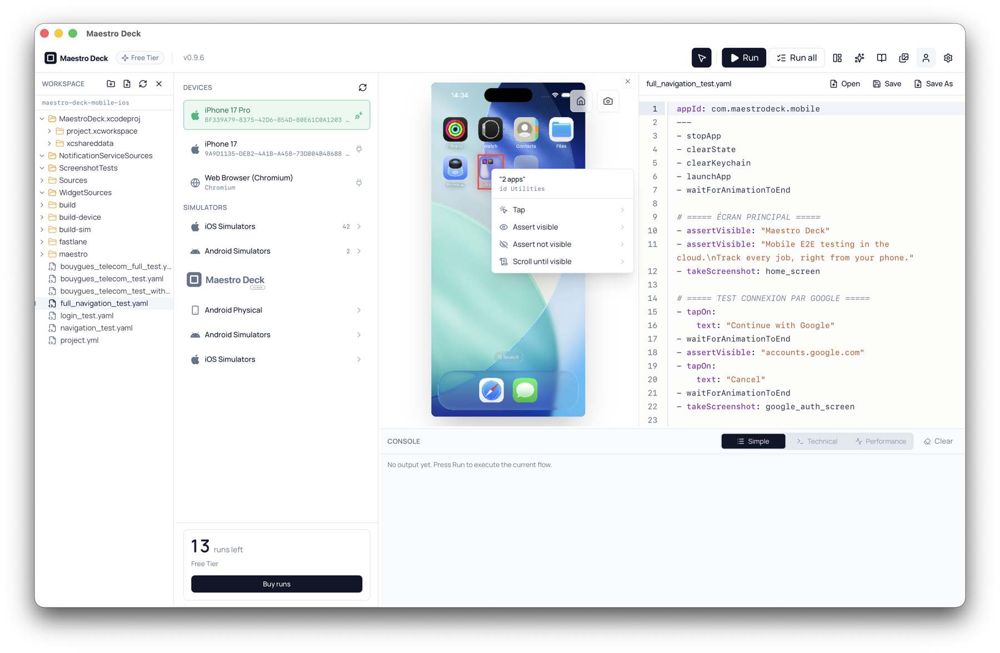

<p align="center">
  
</p>

<p align="center">
  <a href="https://github.com/BlueShork/maestro-deck/releases/latest"><b>Download</b></a> ·
  <a href="https://www.maestrodeck.cloud">Website</a> ·
  <a href="https://www.maestrodeck.cloud/docs">Docs</a> ·
  <a href="https://www.maestrodeck.cloud/faq">FAQ</a> ·
  <a href="https://github.com/BlueShork/maestro-deck/discussions">Discussions</a>
</p>

<p align="center">
  <a href="https://github.com/BlueShork/maestro-deck/releases/latest"></a>
  <a href="https://github.com/BlueShork/maestro-deck/actions/workflows/ci.yml"></a>
  <a href="https://sonarcloud.io/summary/new_code?id=BlueShork_maestro-deck"></a>
  <a href="LICENSE"></a>
  <a href="CONTRIBUTING.md"></a>
</p>

<p align="center">
  
</p>

---

## What is it?

**Maestro Deck** mirrors your device, lets you click on an element to get a selector, and runs the flow with each step lit up as it executes. You write tests by using your app instead of guessing at selectors.

- **Android, iOS and Web** — USB phones, emulators, iOS simulators and Chromium, from the same window.
- **Local first.** Everything runs on your machine. No telemetry, and no account needed.
- **Zero setup.** On first launch the app installs Java, the Maestro CLI (2.10.0) and ADB in its own folder.
- **Native and light.** Built on Tauri 2 (Rust + system webview), not Electron.
- **Source-available** under BUSL-1.1. It becomes Apache-2.0 on 2030-05-15.

---

## Features

### Mirror and inspect
- **Live device mirror.** Low-latency scrcpy stream for Android, ScreenCaptureKit for iOS simulators, CDP screencast for the web.
- **Drive the device from the preview:** tap, swipe, type, Home and Back.
- **Inspector** with element overlay and **smart selectors** (`id` → `text` → `content-desc` → point), portable between Android and iOS.
- **Devices panel** that picks up plugged-in phones and booted simulators on its own, and boots a simulator in one click.

### Build and run
- **YAML editor** (CodeMirror) with Maestro syntax highlighting and autocomplete for every command, dark mode commands from Maestro 2.9 included.
- **Insert from the inspector:** pick an element and an action, and the step lands at your cursor.
- **One-click run** with a live console: the gutter follows each step, failures point to the line that broke, and you can switch between a simple view and raw logs.
- **Run all** over a workspace, with a file tree, folders and a right-click menu.

### Visual regression
- **Screenshot bank.** Store baselines from `takeScreenshot`, compare later runs against them and review side-by-side diffs.

### Billy, the AI assistant
- A chat agent that **sees the screen and acts on it**. It can read the hierarchy, take screenshots, tap and type, launch apps, read and write flows, and run them to fix a failing test.
- Works with your **Maestro Deck account** (no key needed, voice input included), or bring your own key: **Anthropic** or **Google Vertex AI**.

### Maestro Deck Cloud (optional)
- Sign in to **run flows on hosted devices**: an Android emulator, an iOS simulator, or a real phone from the device farm.
- **Live preview** of the remote device while the flow runs, with clear results.
- The label next to **Run** always tells you whether a flow runs locally or in the cloud.

### Everything else
- Guided first test with a sample app, auto-update with release notes, native macOS menu bar, dark and light themes, and a **Tool paths** setting for locked-down machines.

---

## Platform support

| Target                  | Status                                                                                  |
| ----------------------- | --------------------------------------------------------------------------------------- |
| Android (USB, emulator) | ✅ Stable, Android 8.0 (API 26)+ with USB debugging                                     |
| iOS simulator           | ✅ Stable, macOS with Xcode                                                             |
| Web (Chromium)          | 🧪 Beta, turn it on in **Settings → Device & Performance**                              |
| Physical iPhone         | ⚠️ Needs the patched Maestro 2.5.1 bridge, not yet compatible with Maestro 2.10.0       |

| Desktop OS              | Build                                   |
| ----------------------- | --------------------------------------- |
| macOS 12+               | Apple Silicon (`.dmg`, signed and notarized) |
| Windows 10+             | x64 (`.msi` / `.exe`)                   |
| Linux                   | Not packaged yet, [build from source](#build-from-source) |

---

## Quickstart

1. **Download** the installer for your OS from [Releases](https://github.com/BlueShork/maestro-deck/releases/latest).
2. **Launch it.** The first-run setup installs Java, Maestro and ADB. Progress shows next to **Run**. Already have them? The app finds the ones on your `PATH`, or you can point to them in **Settings → Tool paths**.
3. **Connect a device:** plug in an Android phone with USB debugging on, start an emulator, or boot an iOS simulator. It appears in the Devices panel.
4. **Follow the guided first test**, or open a folder of flows and press **Run**.

---

## Build from source

Requires Node 20+, [pnpm](https://pnpm.io) 10+, Rust (via [rustup](https://rustup.rs)) and the [Tauri 2 prerequisites](https://v2.tauri.app/start/prerequisites/).

```bash
git clone https://github.com/BlueShork/maestro-deck.git
cd maestro-deck
pnpm install
pnpm tauri:dev
```

Build a release bundle:

```bash
pnpm tauri:build
```

Installers are written to `src-tauri/target/release/bundle/`.

Useful checks before a PR: `pnpm lint`, `pnpm typecheck`, `pnpm test`, and `cargo test` in `src-tauri/`.

---

## How it works

A single-window Tauri 2 app. The React + TypeScript frontend handles the UI (device canvas, inspector, editor, console, Billy). The Rust backend does the device work: ADB and a bundled scrcpy server for Android, ScreenCaptureKit and `simctl` for iOS simulators, and long-lived `maestro mcp` sessions for the inspector, input and live preview. Flows run through the Maestro CLI.

```
  React (webview)  <── IPC ──>  Rust (Tauri)  ──>  ADB / scrcpy      ──>  Android
                                               ──>  simctl / SCK      ──>  iOS simulator
                                               ──>  maestro mcp / CDP ──>  Chromium
                                               ──>  maestro test      ──>  any target
```

More details in [docs/ARCHITECTURE.md](docs/ARCHITECTURE.md). Release notes are in [CHANGELOG_EN.md](CHANGELOG_EN.md).

---

## Contributing

Contributions of any size are welcome.

- [Good first issues](https://github.com/BlueShork/maestro-deck/labels/good%20first%20issue)
- [Discussions](https://github.com/BlueShork/maestro-deck/discussions)
- [CONTRIBUTING.md](CONTRIBUTING.md) for setup and the PR process
- [Code of Conduct](CODE_OF_CONDUCT.md)

Contributions are accepted under a [Contributor License Agreement](CLA.md). For security issues, see [SECURITY.md](SECURITY.md).

---

## License

Maestro Deck is licensed under the [Business Source License 1.1](LICENSE). Copyright 2026 Ethan Morisset.

- The source is public: you may read, copy, modify and redistribute it.
- You may use Maestro Deck **in production for the internal business operations of your organization** (Additional Use Grant in the [LICENSE](LICENSE)).
- You **may not** offer it as a hosted or embedded service to third parties, or sell it (original or modified) as, or as part of, a commercial product. Those uses need a commercial license. Contact the author.
- On **2030-05-15** the license automatically becomes [Apache-2.0](https://www.apache.org/licenses/LICENSE-2.0).

BUSL-1.1 is a *source-available* license (not OSI-approved), like the ones used by Sentry, MariaDB, CockroachDB and HashiCorp.

---

## Trademark and legal notice

**Maestro Deck™** is a trademark of Ethan Morisset, filed with the French INPI on 2026-05-19 (application n°5259782, Nice classes 9 and 42, under examination).

Maestro Deck is an independent project. It is **not affiliated with, endorsed by, or sponsored by mobile.dev Inc.**, the maintainers of [Maestro](https://maestro.dev). "Maestro" is used only to describe interoperability, and related marks belong to their owners.

Maestro Deck is published by **Ethan Morisset**, entrepreneur individuel registered in France. The desktop app runs locally and collects no telemetry. Signing in to Maestro Deck Cloud is optional and covered by the policies below.

[Mentions légales](https://www.maestrodeck.cloud/legal/mentions-legales) ·
[Terms of use (CGU)](https://www.maestrodeck.cloud/legal/cgu) ·
[Terms of sale (CGV)](https://www.maestrodeck.cloud/legal/cgv) ·
[Privacy](https://www.maestrodeck.cloud/legal/confidentialite) ·
[Cookies](https://www.maestrodeck.cloud/legal/cookies)

---

## Acknowledgements

Thanks to everyone who has contributed code, issues, ideas and feedback. This project is shaped by its contributors.
